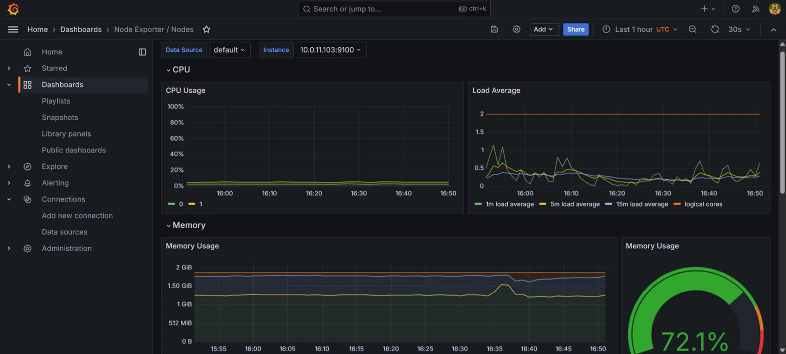
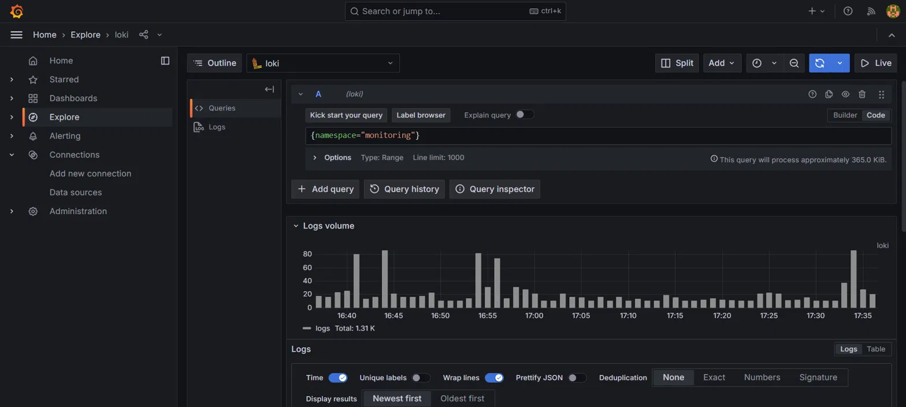
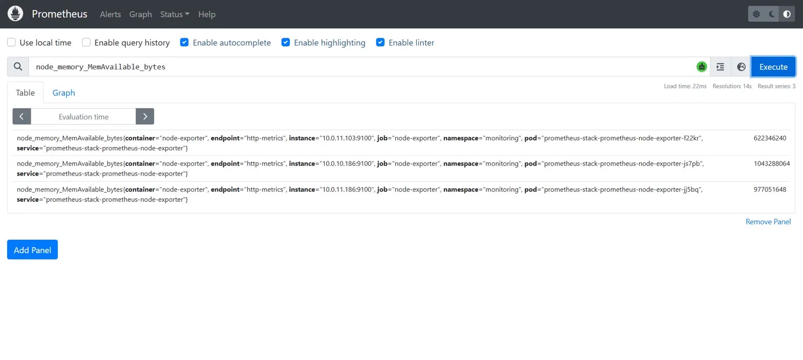
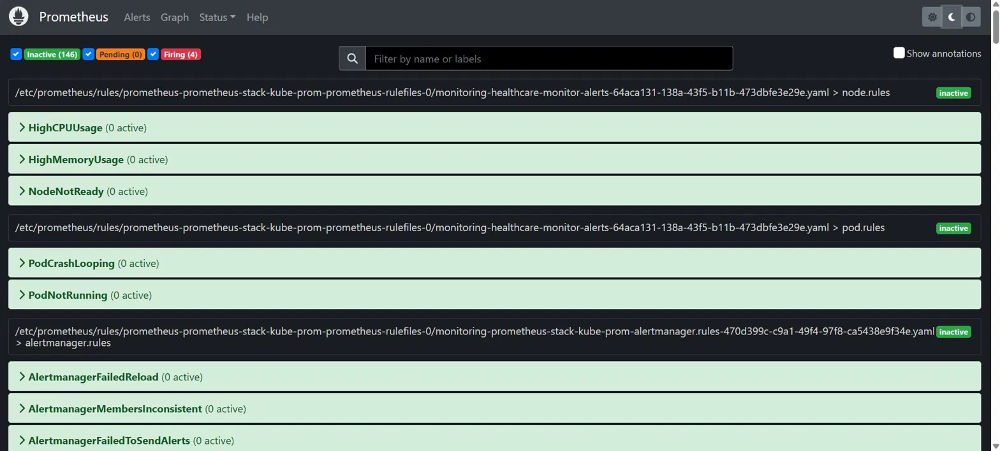
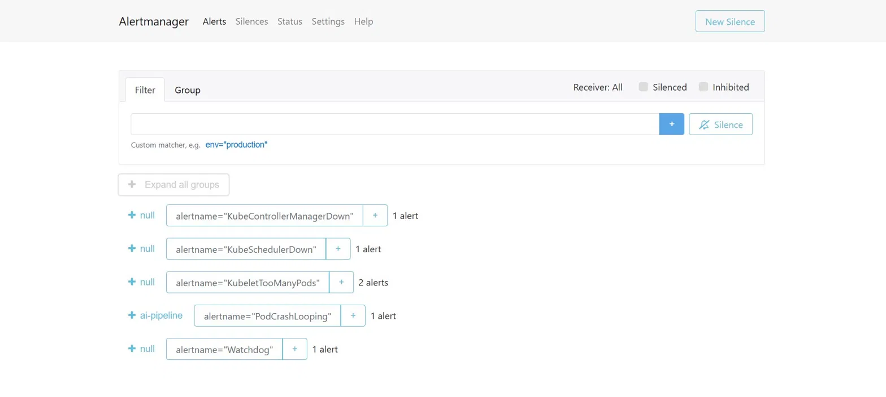
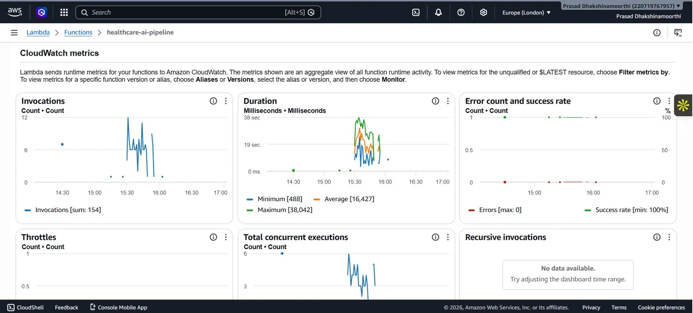
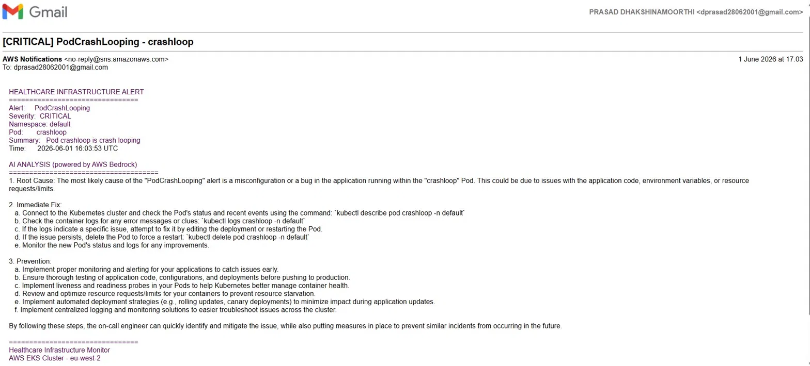

# Enterprise-Grade AI-Powered Infrastructure Monitor

> A production-grade Kubernetes monitoring system with automated AI incident response — built to the security and compliance standards required by regulated industries including healthcare, financial services, and government sectors.

When an infrastructure incident occurs, this system automatically detects it, analyses it with Claude AI via AWS Bedrock, and delivers a root cause analysis with exact remediation steps to the on-call engineer — in under 2 minutes.

---

## Compliance standards addressed

| Standard | How this project addresses it |
|----------|------------------------------|
| NHS DSP Toolkit | KMS encryption, CloudTrail audit logging, private network topology |
| PCI-DSS | Encrypted secrets, full API audit trail, network isolation |
| FCA requirements | Immutable audit logs, access controls, security scanning in CI |
| ISO 27001 | Least-privilege IAM, encryption at rest, incident response automation |

The security architecture — KMS encryption, CloudTrail, private subnets, and enforced CI security gates — represents best practice for any regulated industry.

---

## How it works

```
Infrastructure incident occurs (pod crash, high CPU, node failure)
    │
    ├── Promtail collects logs from all pods → ships to Loki
    │
    ├── Node Exporter + Kube State Metrics → Prometheus scrapes every 15s
    │        → Alert rule threshold exceeded for 5 minutes
    │        → Alert sent to Alertmanager
    │
    ├── Alertmanager routes alert → Lambda webhook
    │        → Lambda calls AWS Bedrock (Claude 3 Sonnet)
    │        → AI generates: root cause + immediate fix + prevention
    │        → SNS delivers email to on-call engineer
    │
    └── Engineer opens Grafana
             → Dashboard shows metrics at time of incident
             → Loki Explore shows exact log lines from affected pod
```

---

## Architecture

```
AWS eu-west-2
└── VPC (10.0.0.0/16)
    ├── Public subnets    — load balancers, NAT gateway
    └── Private subnets   — EKS worker nodes (not internet-facing)
        └── EKS Cluster (Kubernetes v1.32)
            ├── Prometheus        — metrics collection + alerting
            ├── Alertmanager      — alert routing + deduplication
            ├── Grafana           — dashboards + log exploration
            ├── Loki              — log storage (10Gi EBS)
            ├── Promtail          — log collection (1 per node)
            └── Node Exporter     — node-level metrics

Alert Pipeline
└── Alertmanager → Lambda → AWS Bedrock (Claude AI) → SNS → Email

Supporting infrastructure
├── Terraform        — all AWS resources as code
├── ArgoCD           — GitOps deployments via GitHub
├── GitHub Actions   — CI/CD with security scanning
├── CloudTrail       — full AWS API audit logging (all regions)
└── KMS              — encryption at rest for secrets and audit logs
```

---

## Tech stack

| Layer | Technology |
|-------|-----------|
| Cloud | AWS eu-west-2 (London) |
| Container orchestration | Amazon EKS (Kubernetes v1.32) |
| Infrastructure as code | Terraform |
| GitOps | ArgoCD |
| CI/CD | GitHub Actions |
| Metrics collection | Prometheus + Node Exporter + Kube State Metrics |
| Dashboards | Grafana |
| Log collection | Promtail (DaemonSet — 1 per node) |
| Log storage | Loki 3.x with EBS persistence |
| Alert routing | Alertmanager |
| AI analysis | AWS Bedrock — Claude 3 Sonnet |
| Serverless compute | AWS Lambda (Python 3.11) |
| Notifications | AWS SNS |
| Security scanning | Checkov + tfsec (blocks merges on findings) |
| Audit logging | AWS CloudTrail (multi-region) |
| Encryption | AWS KMS (EKS secrets + CloudTrail logs) |
| Storage | AWS EBS gp2 via EBS CSI Driver |

---

## Screenshots

### Grafana — real-time node metrics
CPU usage, memory consumption, and load average across all 3 worker nodes — updated every 30 seconds.



### Loki — live log exploration
1,310 log lines collected from the monitoring namespace, queryable by pod, namespace, and container.



### Prometheus — metrics query
Real available memory data scraped from all 3 nodes every 15 seconds via Node Exporter.



### Prometheus — alert rules
All 5 custom alert rules active: PodCrashLooping, HighCPUUsage, HighMemoryUsage, NodeNotReady, PodNotRunning.



### Alertmanager — routing
PodCrashLooping routed to the ai-pipeline receiver. Infrastructure false-positives silenced to null.



### Lambda — CloudWatch metrics
154 invocations, 100% success rate, average 16-second execution time.



### AI analysis email — the end result
Root cause, immediate fix steps, and prevention recommendations delivered by email automatically.



---

## Alert rules

| Alert | Condition | Severity | Action |
|-------|-----------|----------|--------|
| PodCrashLooping | Restart rate > 0 for 5 minutes | Critical | AI analysis email |
| HighCPUUsage | Node CPU > 80% for 5 minutes | Warning | AI analysis email |
| HighMemoryUsage | Node memory > 85% for 5 minutes | Warning | AI analysis email |
| NodeNotReady | Node not ready for 2 minutes | Critical | AI analysis email |
| PodNotRunning | Pod in Failed/Unknown state for 2 minutes | Warning | AI analysis email |

---

## AI pipeline detail

Lambda receives the Alertmanager webhook and builds a prompt containing the alert name, severity, namespace, pod, and description. Claude analyses the context and returns a structured response:

```
[CRITICAL] PodCrashLooping - crashloop
━━━━━━━━━━━━━━━━━━━━━━━━━━━━━━━━━━━━━━
Alert:     PodCrashLooping
Severity:  CRITICAL
Namespace: default
Pod:       crashloop
Time:      2026-06-01 16:03:53 UTC

AI ANALYSIS (powered by AWS Bedrock)
━━━━━━━━━━━━━━━━━━━━━━━━━━━━━━━━━━━━
Root Cause:
The pod is exiting immediately with a non-zero exit code, indicating
the container command is failing on startup. Most likely causes:
misconfigured entrypoint, missing environment variables, or OOMKill.

Immediate Fix:
a. kubectl describe pod crashloop -n default
b. kubectl logs crashloop -n default --previous
c. Fix the underlying issue (config, image, resources)
d. kubectl delete pod crashloop -n default

Prevention:
- Add liveness and readiness probes
- Set memory/CPU requests and limits
- Use rolling deployment strategies
- Implement pre-deployment smoke tests
```

---

## Security architecture

```
Network isolation
└── All worker nodes in private subnets
    — no direct internet access, outbound only via NAT

Encryption
├── KMS key encrypts all Kubernetes secrets at rest
├── KMS key encrypts all CloudTrail logs
└── EBS volumes encrypted at rest

Audit logging
└── CloudTrail records every AWS API call
    — multi-region, log file validation enabled
    — stored in dedicated S3 bucket with public access blocked

CI/CD security gates
├── Checkov scans Terraform on every push
├── tfsec scans Terraform on every push
└── soft_fail: false — merges blocked on security findings

IAM
└── Lambda role scoped to minimum permissions:
    bedrock:InvokeModel, sns:Publish, logs:PutLogEvents only
```

---

## How to deploy

### Prerequisites

- AWS account with programmatic access (eu-west-2)
- Terraform v1.0+, kubectl, helm, eksctl, argocd CLI
- GitHub account with personal access token

### Deploy

```bash
# Clone
git clone https://github.com/prasadDPR/ai-infrastructure-monitor.git
cd ai-infrastructure-monitor

# Create S3 bucket for Terraform state
aws s3api create-bucket \
  --bucket your-tfstate-bucket-name \
  --region eu-west-2 \
  --create-bucket-configuration LocationConstraint=eu-west-2

# Update terraform/backend.tf with your bucket name
# Update terraform/environments/prod/main.tf with your email

# Deploy infrastructure (15-20 minutes)
cd terraform/environments/prod
terraform init
terraform apply

# Connect kubectl
aws eks update-kubeconfig --name healthcare-monitor --region eu-west-2

# Install ArgoCD
kubectl create namespace argocd
kubectl apply -n argocd -f https://raw.githubusercontent.com/argoproj/argo-cd/stable/manifests/install.yaml --server-side --force-conflicts

# Deploy monitoring stack
kubectl apply -f helm/argocd-apps/prometheus-app.yaml
kubectl apply -f helm/argocd-apps/loki-app.yaml
kubectl apply -f helm/argocd-apps/promtail-app.yaml
kubectl apply -f alerts/alerting-rules.yaml

# Access Grafana
kubectl port-forward svc/prometheus-stack-grafana -n monitoring 3000:80
# http://localhost:3000
```

### Destroy

```bash
cd terraform/environments/prod
terraform destroy
```

---

## Cost

| Resource | Running cost | Destroyed cost |
|----------|-------------|----------------|
| EKS cluster | ~£0.10/hour | £0 |
| 3x t3.small nodes | ~£0.05/hour | £0 |
| NAT Gateway | ~£0.05/hour | £0 |
| EBS 10Gi volume | ~£0.10/day | £0 |
| Lambda + Bedrock | ~£0.01 per alert | £0 |
| CloudTrail + SNS | Free tier | £0 |
| **Total active** | **~£1.50/day** | |
| **Total idle** | **~£0.10/day** | |

Destroy the cluster when not actively working. Rebuild takes 20 minutes.

---

## Project structure

```
.
├── terraform/
│   ├── modules/
│   │   ├── vpc/        — VPC, subnets, NAT, internet gateway
│   │   ├── eks/        — EKS cluster, node groups, IAM, KMS, EBS CSI
│   │   ├── lambda/     — Lambda function, SNS topic, IAM role
│   │   └── security/   — CloudTrail, KMS, S3 audit bucket
│   └── environments/
│       └── prod/       — production environment wiring
├── helm/
│   ├── prometheus/     — kube-prometheus-stack values
│   ├── loki/           — Loki 3.x values
│   └── argocd-apps/    — ArgoCD Application manifests
├── alerts/
│   ├── alerting-rules.yaml      — Prometheus PrometheusRule
│   └── alertmanager-config.yaml — Alertmanager routing config
├── lambda/
│   └── ai_pipeline.py  — alert processing + Bedrock + SNS
└── .github/
    └── workflows/
        └── terraform.yml — security scan + plan + apply pipeline
```

---

## Author

**Prasad Dhakshinamoorthi**
Leicester, UK

[GitHub](https://github.com/prasadDPR) · [LinkedIn](https://linkedin.com/in/prasadDPR)

---

## Licence

MIT
